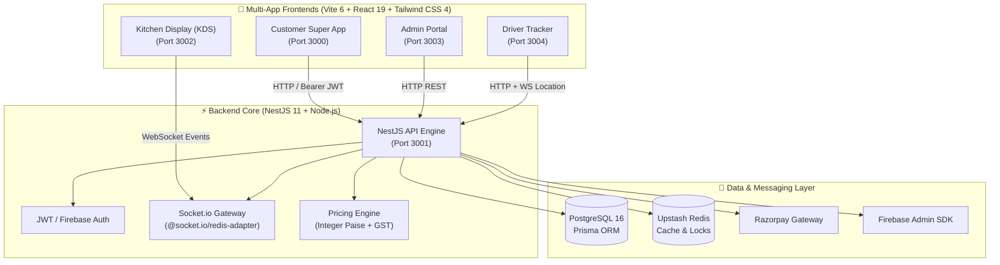

<p align="center">
  
</p>

<p align="center">
  <i>A high-performance, cricket-themed super app & multi-app operational suite for Singarayakonda, Andhra Pradesh.</i>
</p>

<p align="center">
  <a href="#-architectural-overview"></a>
  <a href="#-tech-stack"></a>
  <a href="#-tech-stack"></a>
  <a href="#-tech-stack"></a>
  <a href="#-tech-stack"></a>
  <a href="#-tech-stack"></a>
  <a href="#-tech-stack"></a>
  <a href="#-security--ci"></a>
</p>

<p align="center">
  <a href="#-quick-start">⚡ Quick Start</a> •
  <a href="#-multi-app-ecosystem">📱 Applications</a> •
  <a href="#-architectural-overview">🏗️ Architecture</a> •
  <a href="#-security--ci">🛡️ Security</a> •
  <a href="#-deployment-guide">🚀 Deployment</a>
</p>

---

## 🌟 Key Highlights & Features

- 🏏 **Live IPL Cricket Scores:** Integrated real-time match carousel and dynamic score tracking.
- 🍲 **Food Delivery & Dhaba Dining:** Full menu ordering, pitch-side bench delivery, party celebration quotes, and dynamic vouchers (`IPL10`, `SIXER`, `HATTRICK`).
- 🏟️ **Floodlit Box-Turf Bookings:** Real-time slot locking via Redis `SET NX PX`, gate-pass QR generation, add-on rentals (GoPro, umpires, ball boys).
- 💰 **Paise-Integer Financial Precision:** Every financial column is stored as integer paise (`totalAmountPaise`, `balancePaise`), eliminating floating-point rounding errors.
- 🔐 **OTP-Closed Security Delivery:** Delivery partners must verify customer OTP (bcrypt-hashed server-side) before completing an order.
- ⚡ **Atomic Concurrency Protection:** Conditional updates at the database level prevent race conditions between delivery drivers and booking slots.

---

## 📱 Multi-App Ecosystem

One NestJS API powering five dedicated applications across the business:

| Application | Persona / User | Port | Core Responsibilities | Source Path |
| :--- | :--- | :---: | :--- | :--- |
| 🛒 **Customer Super App** | Diners & Turf Players | `3000` | Food ordering, turf booking, party quotes, wallet top-up, live match scores | `src/` |
| ⚡ **NestJS API Engine** | System Backend | `3001` | JWT Auth, Prisma ORM, Socket.io Gateway, Razorpay payments, Dispatch logic | `apps/backend/` |
| 🍳 **Kitchen KDS** | Chefs & Kitchen Staff | `3002` | Live order queue display, status workflow transitions (`accepted` ➔ `ready`) | `apps/kitchen-kds/` |
| ⚙️ **Admin Control Center** | Business Owner / Manager | `3003` | Real-time analytics, menu management, staff unlocking, booking overrides | `apps/admin/` |
| 🛵 **Driver Tracker** | Delivery Partners | `3004` | Order claim queue, turn-by-turn route tracking, OTP delivery verification | `apps/driver/` |

---

## 🏗️ Architectural Overview



---

## 🔒 Core Engineering Principles

> [!IMPORTANT]
> **Money is stored as integer paise everywhere.**
> Floating-point currency calculations misround GST and Razorpay signatures. All monetary values (`pricePaise`, `totalAmountPaise`) are integer-based. The render layer divides by 100 via `formatPaise()`.

> [!TIP]
> **The Server Owns Every Price.**
> Clients only submit `{ menuItemId, quantity }`. `PricingService` recalculates the total breakdown directly from the database during quote creation. Unknown item IDs return `400 Bad Request`.

> [!NOTE]
> **Ownership Enforced in `where` Clause.**
> Queries fetch scoped rows directly (e.g. `findFirst({ where: { id, userId } })`). Attempting to access another user's order returns `404 Not Found` rather than `403 Forbidden` to prevent object existence enumeration.

> [!WARNING]
> **Database-Level Concurrency Locks.**
> Driver order claiming uses conditional atomic updates (`count === 0` throws `40 ConflictException`). Turf slots use Redis `SET NX PX` locks. Wallet debit transactions enforce non-negative constraints in Postgres.

---

## ⚡ Quick Start

### 1. Prerequisites
- **Node.js 20+** & **npm 10+**
- **PostgreSQL 16+** (Local or Neon)
- **Redis 7+** (Upstash or local Docker container)

### 2. Installation & Setup
```bash
# Clone the repository
git clone https://github.com/Shxam/MobileApp.git
cd MobileApp

# Install all monorepo dependencies
npm install

# Setup environment variables
cp .env.example .env
```

### 3. Database Migration & Seeding
```bash
# Apply Prisma migrations
npx prisma migrate deploy
npx prisma generate

# Seed 76 menu items, turf slots, celebration packages, and staff PINs
SEED_STAFF_PIN=1234 npx prisma db seed
```

### 4. Running Development Servers

Launch backend and frontend apps in separate terminals:

```bash
# 1. Start NestJS Backend API (Port 3001)
npm run dev:backend

# 2. Start Customer Super App (Port 3000)
npm run dev

# 3. (Optional) Start Kitchen KDS (Port 3002)
npm run dev:kds

# 4. (Optional) Start Admin Portal (Port 3003)
npm run dev:admin

# 5. (Optional) Start Driver App (Port 3004)
npm run dev:driver
```

---

## 🛠️ Tech Stack Matrix

| Layer | Technologies Used |
| :--- | :--- |
| **Frontend Apps** | React 19, Vite 6, TypeScript 5.8, Tailwind CSS 4, Framer Motion, Lucide Icons, Leaflet Maps, Socket.io Client |
| **Backend Core** | NestJS 11, TypeScript, Prisma ORM 5.22, Socket.io, `@nestjs/throttler`, `@nestjs/schedule`, Passport JWT, Bcrypt |
| **Database & Cache** | PostgreSQL 16 (Neon / Local), Redis (Upstash / Local), BullMQ |
| **Integrations** | Razorpay Payments (HMAC Webhooks), Firebase Auth (Phone OTP), Google OAuth, Live Cricket API |
| **Testing & CI/CD** | Jest 30, Supertest, GitHub Actions, Docker, Strix AI Security Scanner |

---

## 🛡️ Security & CI/CD Pipeline

The project integrates automated security scanning and continuous testing:

```bash
# Run backend integration & component unit tests (158 passing specs)
npm test

# Run TypeScript typechecks
npm run lint          # Frontend typecheck
npm run lint:backend  # Backend typecheck
```

- **Strix AI Pentesting:** Continuous pre-merge AI vulnerability scanning via `.github/workflows/security-scan.yml`.
- **JWT Refresh Rotation:** Short-lived access tokens (15m) with automatic refresh token rotation & Redis blocklisting.
- **Strict CORS & Throttling:** Rate-limiting via `@nestjs/throttler` and strict origin verification in production.

---

## 🚀 Free Deployment Guide (No Credit Card)

You can deploy the complete stack for **100% FREE** without providing a credit card:

1. **Frontend (Vercel):** Connect `https://github.com/Shxam/MobileApp.git` to **Vercel** for instant Vite deployment.
2. **Backend API (Render / Koyeb):** Deploy `apps/backend` as a Node.js Web Service on **Render.com** or **Koyeb.com**.
3. **PostgreSQL Database (Supabase / Neon):** Provision a free 500MB Postgres database on **Supabase.com** or **Neon.tech**.
4. **Redis Cache (Upstash):** Create a free serverless Redis cluster on **Upstash.com**.

---

<p align="center">
  Designed & Built with ❤️ for <b>Singarayakonda IPL Dhaba & Box Turf</b>
</p>
